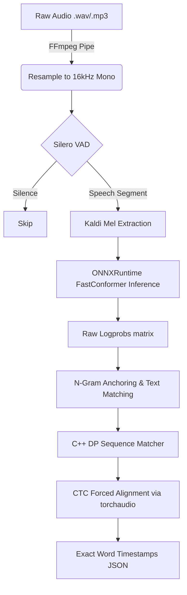

بفضل الله و برحمته الحمد لله رب العالمين

# Quran Recite to Text (Lightweight CPU Edition)

This project provides an automated, lightweight pipeline for transcribing and aligning Quranic
recitations with the exact text of the Quran. It processes audio files of reciters, transcribes the
Arabic phonetics/text, and precisely aligns the results against a canonical Quran index to provide
highly accurate timestamps at the segment, word, and even letter level.

## Screenshot


## Fast Use

- **fast usage to test** : go to folder where run.py is and add a recitation "audio.mp3" then open
  cmd in folder ` python run.py --audio audio.mp3` The output will be saved as `output.json` in the
  same directory, featuring a production-ready schema perfectly matched to downstream applications
  like QuranCaption.

## Projects Used

- **Original System**: This architecture is ported from
  [Hetchy's Quranic Universal Aligner](https://huggingface.co/spaces/hetchyy/quranic-universal-aligner).
  While Hetchy's version utilized heavy models on HuggingFace Space requiring GPUs and interactive
  UIs, this repository provides a highly optimized, pure CLI version that runs entirely on the CPU.
- **Acoustic Model**: updating link insha'a Allah ..but it is in releases
  [Model](https://github.com/Iam-Muslim/QuranReciteToText/releases/tag/model)
- **Adaptive Silence Engine**: Silence and speech segmentation is handled by the **ahmed-alramah PR
  in Munajjam PR #65 Adaptive Silence Engine** (Librosa RMS peak-relative splitting + 4-Level
  Progressive Retry
  Relaxation).[ahmed-alramah Pull Request](https://github.com/Itqan-community/Munajjam/pull/65/changes)

---

## 📂 Project Structure & File Architecture

The codebase is strictly modularized into 4 distinct phases, orchestrated by a central entry point:

- `run.py`: The main CLI entry point. It handles user arguments and triggers the pipeline.
- `src/core/main_flow.py`: The orchestrator. It sequentially routes the audio through the 4 phases
  and passes data between them.

**Phase 1: Acoustic Transcription** (`src/phase1_transcribe/`)

- `stream.py`: Handles audio ingestion via FFmpeg, and splits the audio using Munajjam PR #65
  Adaptive Silence Detection. It feeds these acoustic chunks into the neural network.
- `fastconformer.py`: The ONNX acoustic model that converts the raw audio into Arabic phonetics and
  CTC probabilities (`logprobs`).

**Phase 2: Text Matching** (`src/phase2_matching/`)

- `normalize.py`: Cleans the acoustic Arabic output (stripping diacritics/tashkeel) so it can be
  mathematically matched against the true Quran text.
- `matcher.py`: Uses C++ Dynamic Programming (`qua_sdk`) to align the imperfect acoustic text
  exactly to the canonical Uthmani script.

**Phase 3: CTC Forced Alignment** (`src/phase3_alignment/`)

- `ctc_align.py`: Uses PyTorch/Torchaudio to execute Viterbi forced alignment, mapping the
  authenticated Uthmani words back onto the acoustic probability matrix to extract frame-perfect
  timestamps.

**Phase 4: Ayah Splitting & Export** (`src/phase4_splitting/`)

- `ayah_split.py`: A critical fallback module. Since VAD is "blind" and only cuts on silence, it may
  merge Ayahs if the reciter doesn't pause. This script uses the true matched Quran text to
  mathematically slice those merged chunks precisely at the Ayah boundaries.
- `export.py`: Formats the final, perfected timeline into `output.json`.

---

## How It Works

The pipeline abandons legacy overlapping sliding window approaches in favor of dynamic Voice
Activity Detection (VAD) segmentation, ensuring optimal performance on a CPU-bound environment:



1. **Audio Ingestion**: Audio files (`.wav`, `.mp3`, etc.) are rapidly loaded and resampled to a
   consistent 16kHz mono format via an `ffmpeg` pipe for efficiency without memory bloat.
2. **Adaptive Silence Segmentation**: The audio is processed sequentially using **Munajjam PR #65
   Adaptive Silence Engine** to detect genuine speech segments and accurately skip over non-speech
   silences.
3. **CPU Acoustic Transcription**: Speech segments undergo exact Kaldi Mel feature extraction and
   are passed to a native **ONNXRuntime** FastConformer session, yielding a raw sequence of token
   probabilities (`logprobs`).
4. **Quranic Text Matching**: The ASR text output is anchored and mathematically aligned to the true
   QPC Hafs script using a blazing-fast C++ Dynamic Programming engine (`qua_sdk`).
5. **CTC Forced Alignment**: The exact, authenticated Uthmani words are mapped back onto the
   acoustic probability matrix via `torchaudio`'s Viterbi forced alignment, yielding mathematically
   optimal, frame-perfect start and end times for every single word without drifting or overlaps.

---

## 💻 Run Pipeline

### Prerequisites

- **Python**
- **FFmpeg**: Must be installed and accessible in your system PATH.

### Usage

Use the provided `run.py` script to transcribe an audio file from the command line. This will
process the audio offline on your CPU and output a highly detailed JSON file.

```bash
python run.py --audio <path-to-audio-file> --out <path-to-output-json> [--fast] [--workers <num>]
```

### Examples

To process a sample audio file named `recitation.mp3`:

```bash
# Normal mode (sequential, lightweight on CPU)
python run.py --audio recitation.mp3

# Fast mode (parallel asynchronous transcription, blazing fast on multi-core CPUs, defaults to 4 workers)
python run.py --audio recitation.mp3 --fast

# Ultra-Fast mode (Max out a powerful CPU by manually scaling the number of workers)
python run.py --audio recitation.mp3 --workers 12
```

---

## 📄 JSON Output Structure

The pipeline generates two distinct outputs during execution:

1. `raw_transcription.json`: The intermediate output from Phase 1. This contains purely acoustic
   chunks based on VAD silences. **Note:** VAD is blind; if a reciter reads two Ayahs without
   pausing, this file will merge them.
2. `output.json`: The final, perfected output from Phase 4. This uses the true Quran text to slice
   the data mathematically, ensuring exact Ayah boundaries even if the reciter never paused.

The `output.json` is saved as a JSON array perfectly mirroring the schema of the original QUA
engine, including comprehensive repetition tracking.

```json
[
	{
		"segment_number": 1,
		"start_time": 0.0,
		"end_time": 12.5,
		"transcribed_text": "...",
		"matched_text": "بِسْمِ اللَّهِ الرَّحْمَٰنِ الرَّحِيمِ",
		"matched_ref": "1:1:1-1:1:4",
		"match_score": 0.98,
		"has_missing_words": false,
		"has_repeated_words": false,
		"words": [
			{
				"word": "بِسْمِ",
				"start": 0.5,
				"end": 1.2,
				"location": "1:1:1"
			}
		]
	}
]
```

### Key Fields:

- `start_time` / `end_time`: The absolute boundaries of the spoken segment in the audio.
- `matched_text`: The exact, orthographically correct Quranic text matched from the canonical index.
- `matched_ref`: The Quranic reference span (e.g., `Surah:Ayah:Word-Surah:Ayah:Word`).
- `match_score`: Confidence score of the match.
- `has_missing_words` / `has_repeated_words`: Flags indicating recitation anomalies (useful for
  grading).
- `wrap_word_ranges`, `repeated_ranges`, `repeated_text`: Arrays that mathematically track when a
  reciter loops back and repeats verses (Wraparound DP tracking).
- `words`: Detailed array of every word spoken, containing absolute `start`/`end` times, and its
  exact `location` index in the Quran (e.g., `1:1:1` for Surah 1, Ayah 1, Word 1).

---

## 🎯 What It Can Be Used For

The JSON output unlocks several powerful applications:

1. **Interactive UI Highlighting**: Build web or mobile apps that highlight words exactly as the
   reciter speaks them.
2. **Automated Video Subtitling**: Generate perfectly synchronized Arabic and translated subtitles
   for YouTube videos or social media clips.
3. **Recitation Evaluation & Grading**: Use the `match_score`, `has_missing_words`, and
   `has_repeated_words` indicators to automatically assess the accuracy of a student's memorization
   (Hifz).
4. **Smart Audio Search**: Jump to a specific Ayah or Surah inside a massive audio file instantly
   using the absolute timestamps.
5. **Dataset Generation**: Automatically clip long hours of Taraweeh or Murattal audio into cleanly
   segmented, labeled Ayah-by-Ayah datasets for training other AI models. (using a larger model is
   better for this)

---

## Insha'a Allah :

- [x] speedup matching الحمد لله رب العالمين
- [x] integrate in QuranCaption application
- [x] Improve Accuracy
- [x] Improve Json output (1:1 schema parity with original QUA)

## outdated data here
